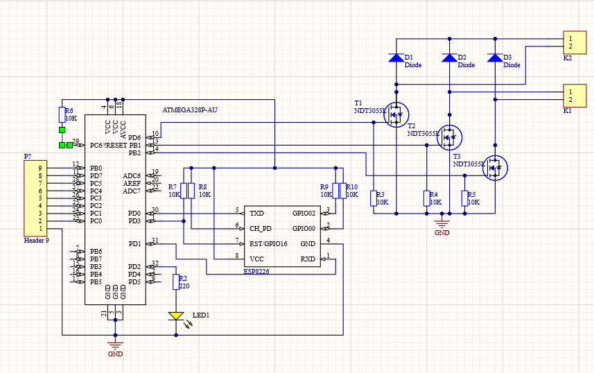
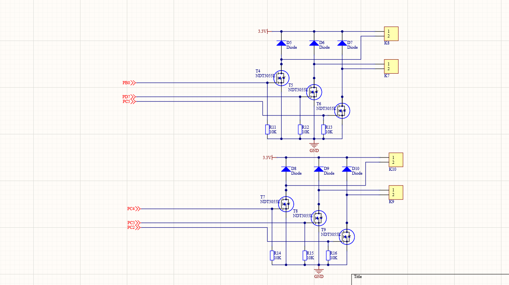
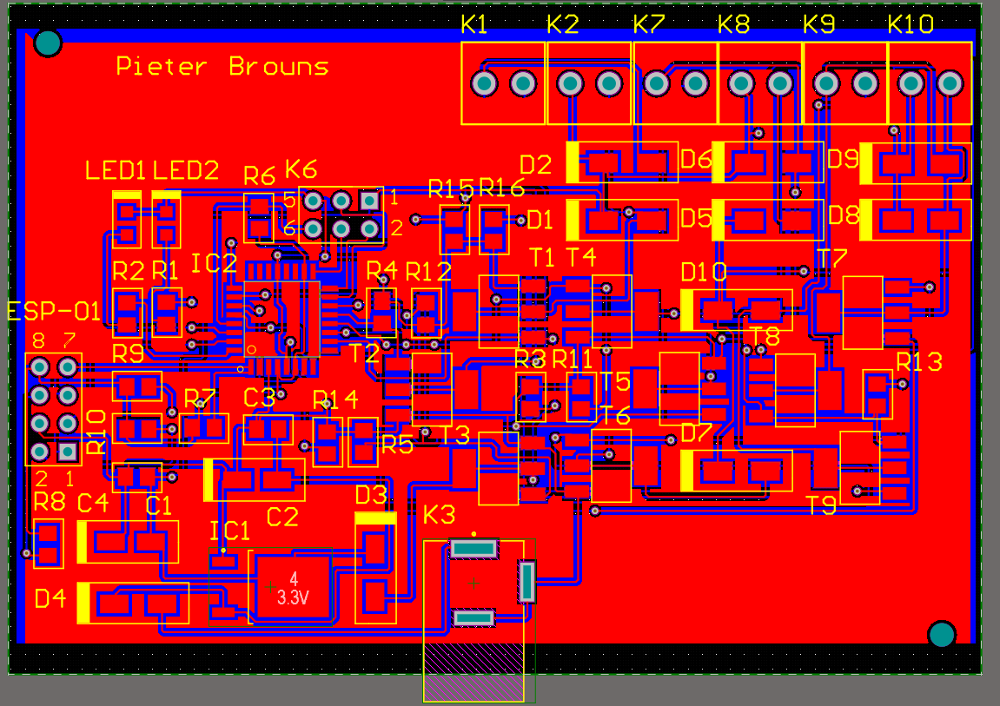

# ledstrip-controllerPOW
Dit is een project dat de kleur van een ledstrip kan laten veranderen met een mobiele app.
Op onderstaande foto is de finale versie van de schematics en het PCB-design te zien. In deze repository zijn alle taken aanwezig die ik heb moeten maken voor het vak Project Ontwerpen die gerelateerd waren aan dit project. Dit is de link naar de youtube video waarin ik mijn design laat zien. https://youtu.be/z12qWsEcEL0

